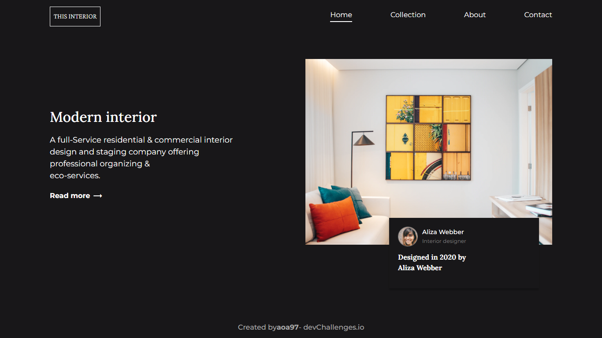

<h1 align="center">Interior Consultant Landing (UI)</h1>

   Solution for <a href="https://devchallenges.io/challenges/Jymh2b2FyebRTUljkNcb" target="_blank">the challenge</a>.

  <h3>
    <a href="https://aoa97.github.io/interior-consultant-landing/">
      Demo
    </a>
     | 
    <a href="https://devchallenges.io/solutions/TISGuSIQJHvCwy4bkETt">
      Solution
    </a>
     | 
    <a href="https://devchallenges.io/challenges/Jymh2b2FyebRTUljkNcb">
      Challenge
    </a>
  </h3>

<!-- TABLE OF CONTENTS -->

## Table of Contents

- [Overview](#overview)
  - [Built With](#built-with)
- [Features](#features)
- [How to use](#how-to-use)
- [Contact](#contact)

<!-- OVERVIEW -->

## Overview

### Built With

<!-- This section should list any major frameworks that you built your project using. Here are a few examples.-->

- HTML
- CSS (SASS)
- VanillaJS 

## Contact

- GitHub [@aoa97](https://github.com/aoa97)
- LinkedIn [@aoa97](https://www.linkedin.com/in/engahmedusama/)
